# Registro de usuarios

> [!IMPORTANT]
>
> Debes tener instalado
>
>[Node JS 20.8.1](https://nodejs.org/dist/v20.8.1/node-v20.8.1-x64.msi)
>[Mongo Community Server](https://www.mongodb.com/try/download/community)

> [!NOTE]
> 
>Aqui encontrara las capturas de pantalla de los diferentes puntos establecidos durante el TALLER 1 Creación API falsa

## Doctor
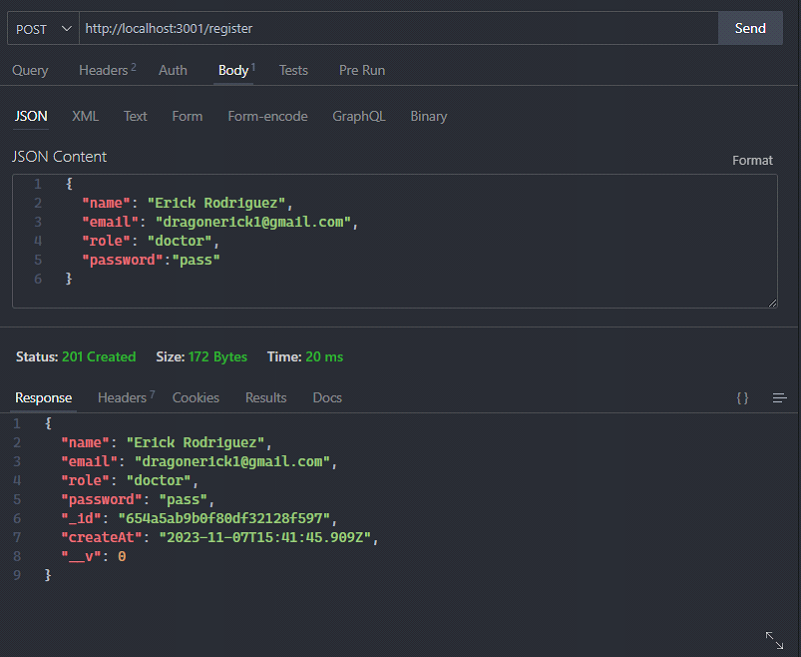

## Paciente
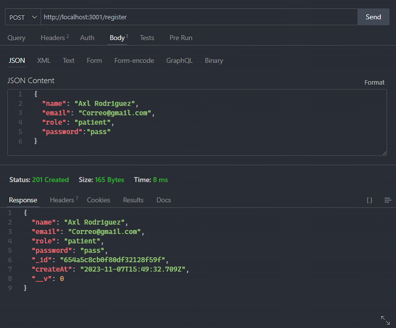

## Login
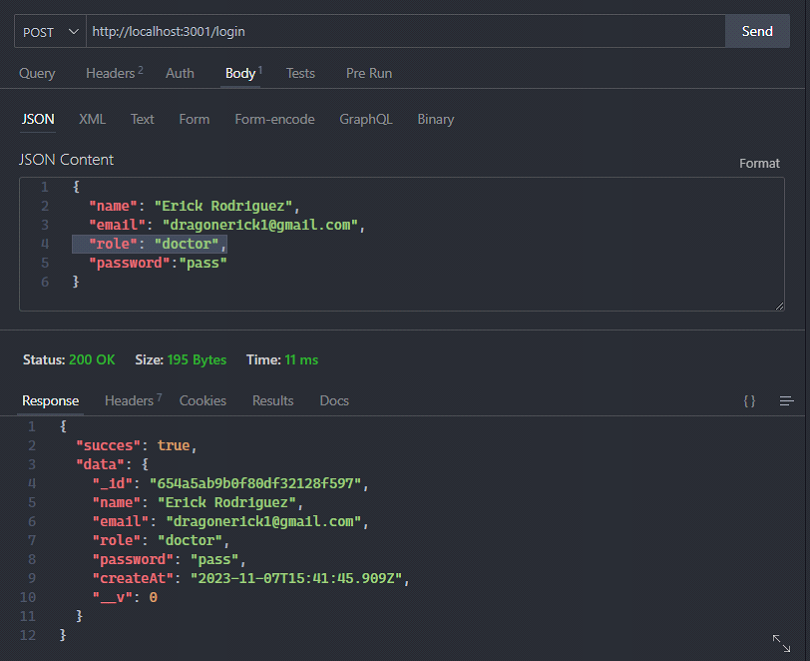

## Registro de servicios
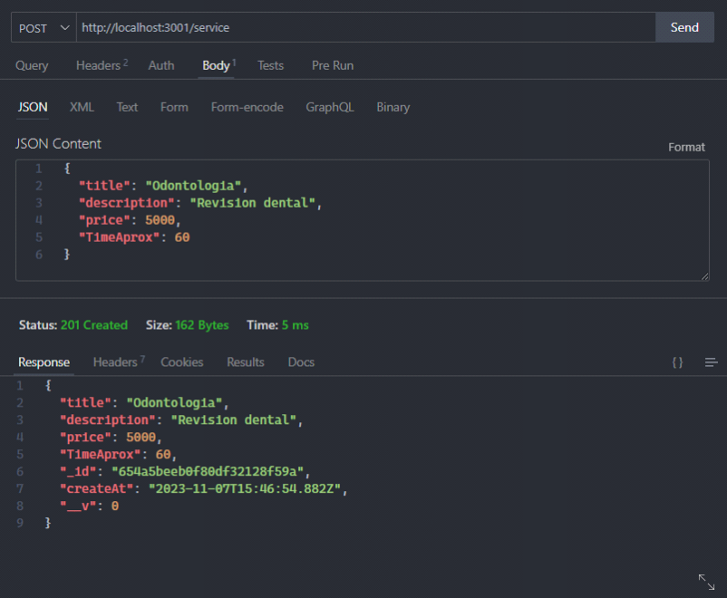

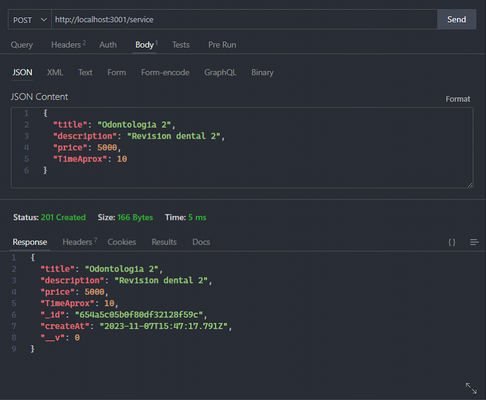

## Registro de citas
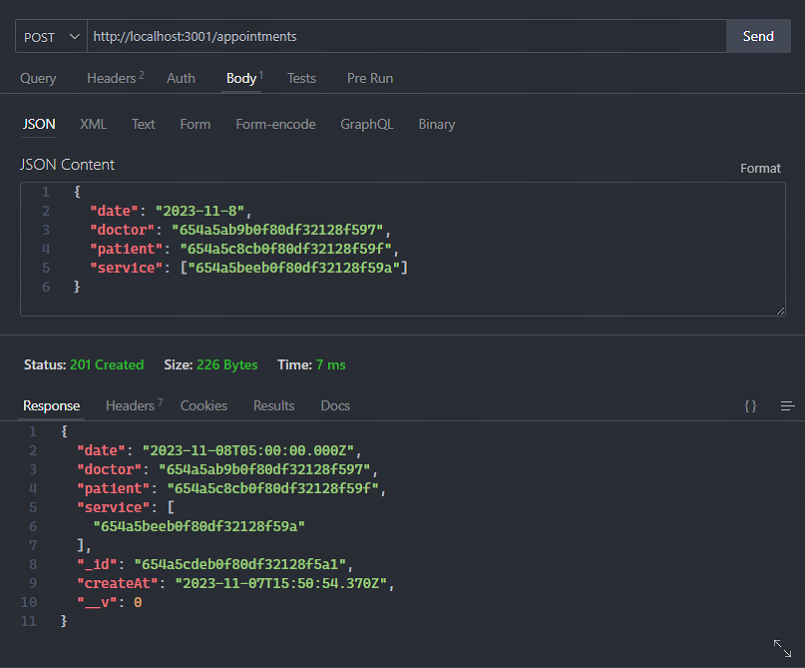

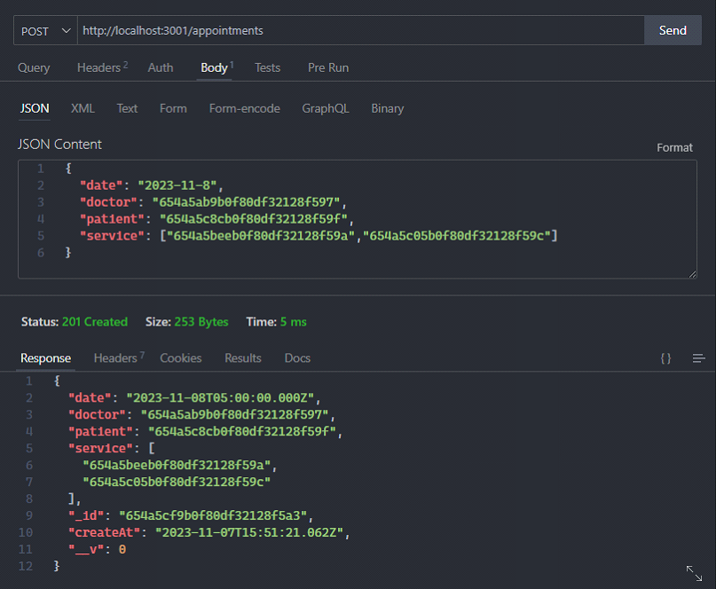

## Registro de agenda
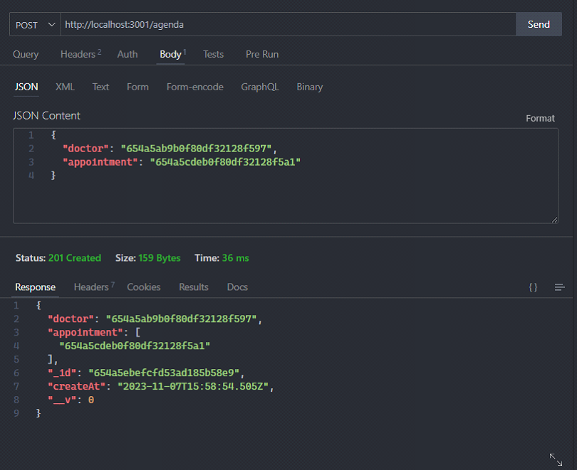

## Ordenamiento por precio
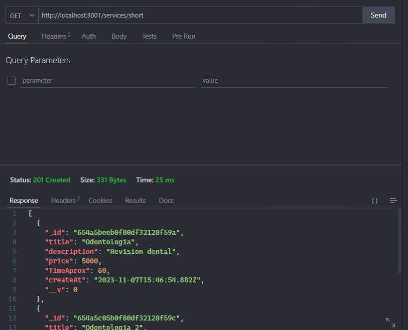

## Busqueda por ID
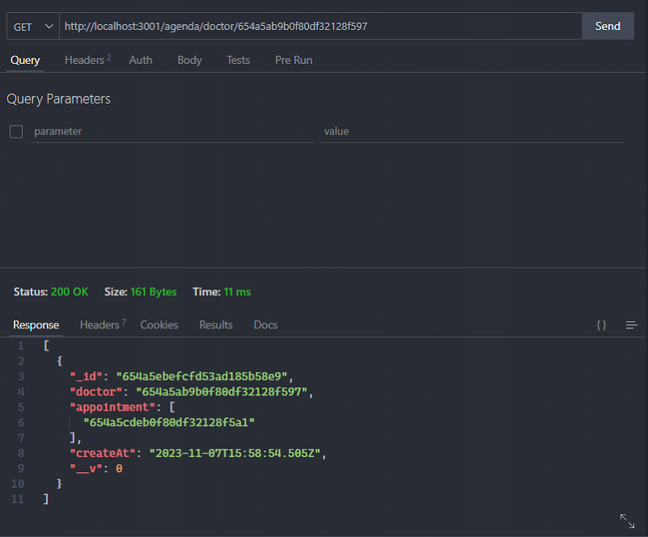

## Busqueda por cita realizada
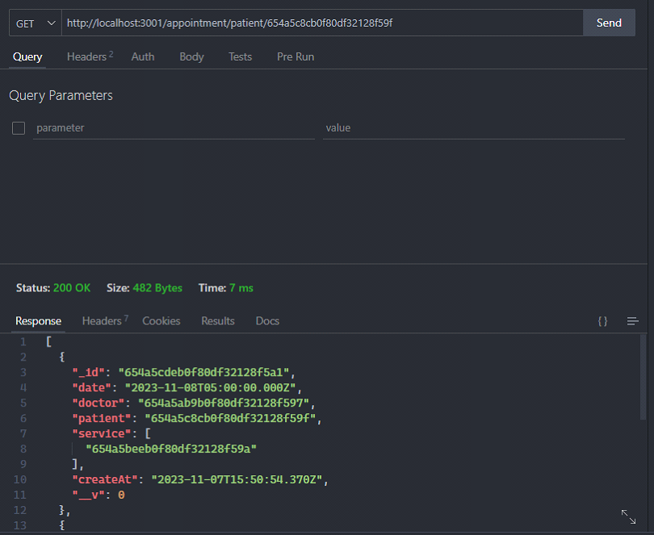

## Update
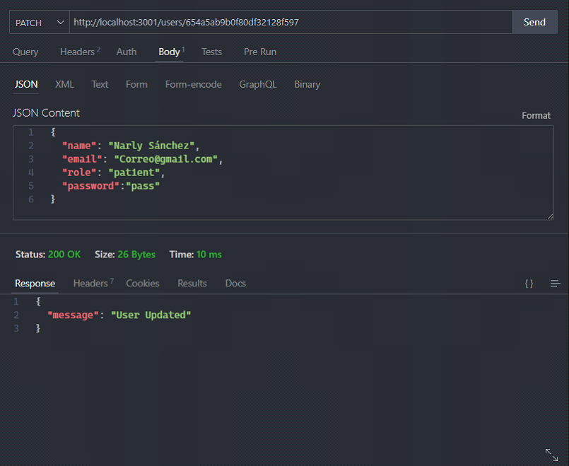

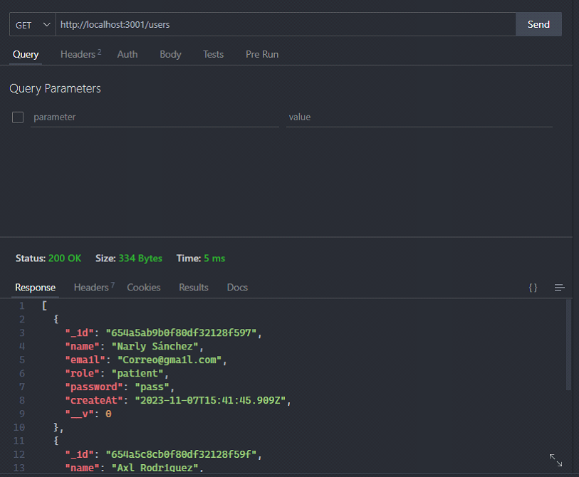

## Eliminar
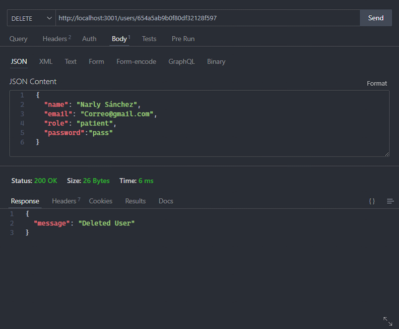

## Filtro nuevo
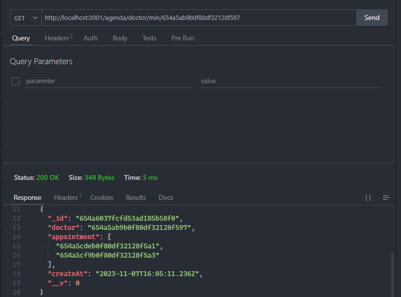